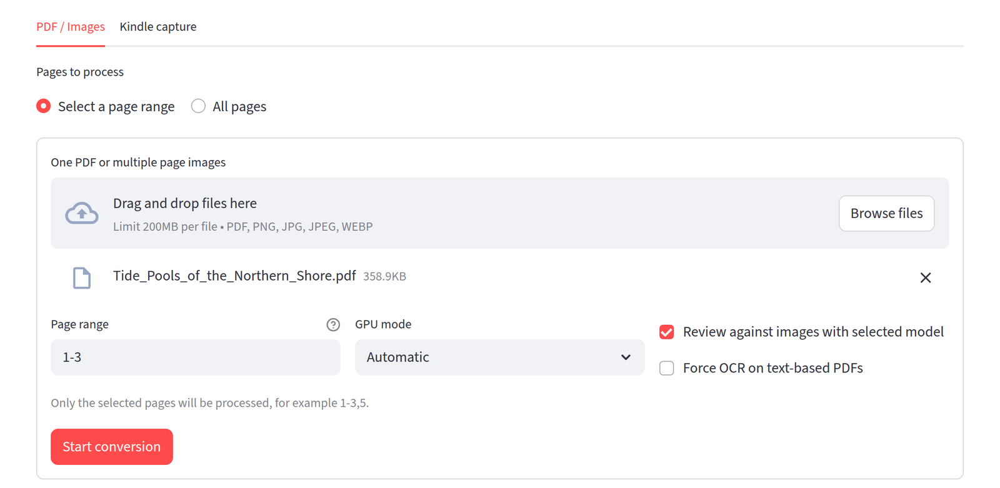
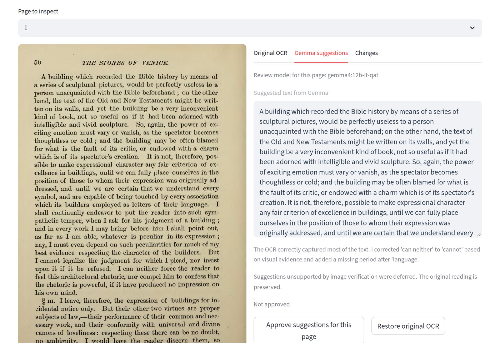
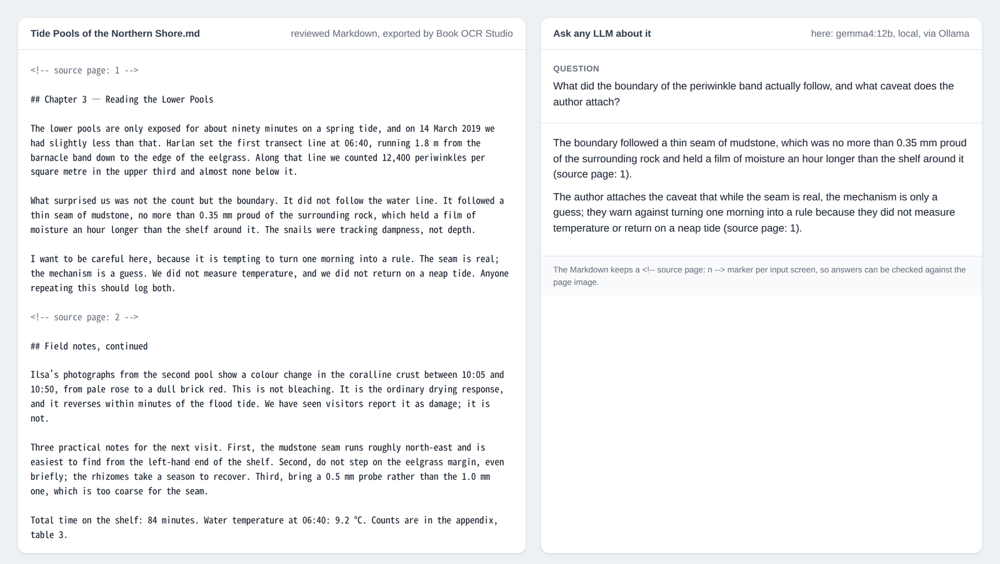

*The block above is Hugging Face Space metadata; it is not application configuration.*

# Book OCR Studio — Local-first book OCR

Turn your Kindle books, PDFs and page images into files you can read, search or give to a language model — on your own computer.

**Local OCR. Local Gemma review. Local MD, HTML, PDF and EPUB export.**

## What it looks like

Click any image to enlarge it.

**1 · Start.** Upload a PDF or page images, or switch to the Kindle capture tab.

**2 · Review against the page image.** Compare the page image with the suggested text; the original OCR is kept until you approve a page.

On this page Gemma proposed changing "can neither" to "cannot". The image check did not support it, so the suggestion was deferred and the original reading kept — the note and the deferral message are visible above the Approve / Restore buttons.

**3 · Use the Markdown.** The export keeps a `<!-- source page: n -->` marker per screen, so any LLM answer can be checked against the page.

The page in image 2 is a public-domain scan (Ruskin, *The Stones of Venice*, 1890 edition, page 50, via Wikimedia Commons); images 1 and 3 use a short synthetic text written for this documentation. The answer in image 3 was produced by the local `gemma4:12b` through Ollama. The images illustrate the interface, not an accuracy level.

This is a Linux-focused source beta. See [INSTALL.md](INSTALL.md) for the isolated-environment installer and [RELEASE_NOTES.md](RELEASE_NOTES.md) for the exact validation scope. Compatibility with every GPU, language or Kindle layout is not guaranteed. On Hugging Face, this Space is a static distribution page; processing runs on your own computer.

## Workflow

1. Install Ollama, then follow [INSTALL.md](INSTALL.md). Standard `bash install.sh` prepares Gemma 12B and the included C1 workflow. Then launch `bash run.sh` from the project directory and open `http://127.0.0.1:8507/`.
2. Upload one PDF or multiple page images, or open a book in the connected Kindle Chrome window.
3. Select a page range or **All pages**. Kindle capture uses `0` for the entire book; a positive capture limit produces a sample.
4. Choose a Gemma model and GPU mode, or configure the optional vision connector, then start. Completed pages are saved for recovery.
5. Inspect source images, original OCR, suggested text and diffs. Approve suggestions per page if desired.
6. Download MD or independently create HTML, PDF or EPUB. Export does not repeat OCR or Gemma inference.

## Output formats

| Format | Content |
| --- | --- |
| MD | Model-input text with source-screen references, separate unapproved suggestions and review notes |
| HTML | Self-contained source images beside text and suggestions |
| PDF | Source-image pages followed by selectable/searchable reading text and separate suggestions; bookmarks by input screen |
| EPUB 3 | Reflowable reading text with navigation, separate suggestions and embedded source images |
| ZIP | Existing job records, images and review artifacts |

Filenames default to `Book title_Author.ext`; when the author is unknown, the title alone is used. Titles and authors remain in their original language. PDF and EPUB are reading copies, not reproductions of publisher typography. Input-screen numbering is not necessarily printed page numbering. Source images preserve layouts that OCR may interpret incorrectly.

**Original OCR is never silently replaced by unapproved model suggestions.** The reading text uses original OCR unless a matching candidate has been explicitly approved. Both OCR and model review can be wrong. Check the image for important quotations, numbers and names. A successful review is not proof of correctness.

## What stays local

- OCR, image-based Gemma review, source images, suggestions and exports stay in the local workflow. No cloud AI service is used by default. If you explicitly enable the optional API connector, images and OCR text are sent to the endpoint you select.
- The app listens on `127.0.0.1:8507`; the optional Chrome bridge uses `127.0.0.1:8508`.
- Initial dependency/model downloads need internet access. Kindle login and reading communicate with Amazon. Browser extensions, translation services and files you choose to upload elsewhere are outside the local processing boundary.
- The app preserves the source language; it does not translate books. Accuracy varies by language, layout and scan quality. Japanese and English samples have been tested; other languages are not universally validated.

## License and optional engines

Original application code: **AGPL-3.0-only** ([LICENSE](LICENSE)). See [third-party notices](THIRD_PARTY_NOTICES.md) for separate dependency and model terms. No weights, environments or book content are part of the intended source distribution.

**Marker is the default OCR engine for new jobs.** YomiToku is an explicit optional choice with CC BY-NC-SA 4.0 terms unless separately licensed. Marker/Surya model weights also have additional conditions: choosing Marker is not a declaration of unrestricted commercial eligibility. Source-only packaging does not remove third-party obligations.

## Models and hardware

- Default UI model: `gemma4:12b-it-qat`; optional `gemma4:26b-a4b-it-qat`.
- UI profile name: **Möbius Custom C1 for OCR**. This is the app's OCR-specific prompt/review workflow, not a fine-tuned weight release or execution of the entire published C1 governance wrapper.
- OCR: Marker by default; YomiToku is available only as an explicit selection when its separate environment is installed. The shared selector applies to PDF, images and Kindle.
- Single-GPU parallel mode requires **YomiToku + 12B**, explicitly selected, and at least **14.5GB free VRAM**. A 16GB or larger GPU is recommended. A 12GB card does not meet this mode's current requirement.
- Sequential mode runs OCR then Gemma. Two-GPU mode separates them. Automatic scheduling chooses from available resources and recorded timing/bandwidth data; it is not a proven optimal scheduler.
- VRAM failures can fall back from shared GPU to dual GPU, then sequential processing when resources permit. Other applications' GPU jobs are not stopped.
- Existing successful page reviews are preserved when resuming, so changing the selected model does not retroactively change them.

## Optional models and API servers

Gemma 4 remains recommended. An opt-in **OpenAI-compatible Chat Completions connector** supports user-selected **vision-capable** models. API compatibility alone does not guarantee image/JSON support, full-job completion or accuracy. Local OCR runs first; this app does not manage the chosen server's GPU. See [CONNECTORS.md](CONNECTORS.md) for setup, content transfer, plaintext local credential storage and limitations.

## Installation and dependencies

The app/Marker environment is `.venv`; optional YomiToku uses a separate `.venv-yomitoku`. `requirements.txt` lists pinned direct app dependencies, and `requirements-yomitoku.txt` lists the optional engine dependencies. The default Python 3.10 install also uses `constraints-linux-py310.txt`, a tested transitive version snapshot without artifact hashes. Python 3.11 and optional YomiToku resolve separately. The installer does not inherit system Python packages. See [INSTALL.md](INSTALL.md) for NVIDIA, Chrome and Ollama prerequisites.

PDF export uses PyMuPDF; EPUB uses the Python standard library. No cloud API is needed. The standard installer downloads missing 12B weights locally under their own terms; they are not included in this source ZIP. 26B is an optional additional download. Browser binaries are installed separately.

## Local data and source

- `app.py`, `kindle_ui.py`: UI
- `oneclick.py`, `kindle_capture.py`, `chrome-extension/`: Kindle capture
- `core.py`, `region_review.py`, `verify_edits.py`: review and source preservation
- `scheduler.py`, `gpu_fallback.py`: GPU selection and fallback
- `delivery.py`, `delivery_ui.py`, `portable_export.py`: on-demand exports
- `review_connector.py`, `connector_ui.py`: optional vision API transport and consent UI
- `jobs/`, `captures/`: private source material and processing state
- `.connector-profiles/`: private endpoint profiles and credentials; never publish

Do not include jobs, captures, downloaded books, browser profiles, credentials or personal logs in a public release.

## Verification and publication

Run `python3 scripts/verify_public.py .` to check a built source package. Public smoke tests use only generated synthetic material. Read [RELEASE_NOTES.md](RELEASE_NOTES.md) for limitations and [HUGGINGFACE.md](HUGGINGFACE.md) for upload instructions. Private experimental books, logs and machine-specific evidence are not included.

## Redistributing modified versions

See [HUGGINGFACE.md](HUGGINGFACE.md) for owner-facing packaging and upload instructions.
